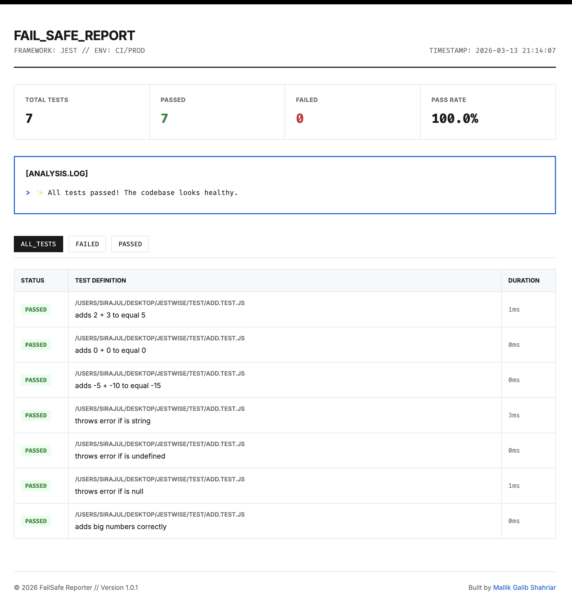

# JestWise

A simple `add()` function. Looks harmless. Breaks in 3 ways.

This project demonstrates white-box unit testing using Jest —
finding edge cases that black-box testing would never catch.

---

## The bug

```js
function add(a, b) {
  return a + b;
}
```

Looks fine. But watch this:

| Input               | Expected | Actual                 |
| ------------------- | -------- | ---------------------- |
| `add("2", 3)`       | Error    | `"23"` — string concat |
| `add(undefined, 3)` | Error    | `NaN`                  |
| `add(null, 1)`      | Error    | `1` — silently wrong   |

Black-box testing misses all three. White-box testing catches them.

---

## The fix

```js
function add(a, b) {
  if (typeof a !== "number" || typeof b !== "number") {
    throw new Error("Both inputs must be numbers");
  }
  return a + b;
}
```

---

## Test results

7 test cases. 4 passed before fix. 7 passed after.

| Test Case                   | Before Fix | After Fix |
| --------------------------- | ---------- | --------- |
| `add(2, 3)` → 5             | ✅ Pass    | ✅ Pass   |
| `add(0, 0)` → 0             | ✅ Pass    | ✅ Pass   |
| `add(-5, -10)` → -15        | ✅ Pass    | ✅ Pass   |
| `add(MAX_SAFE_INTEGER, 1)`  | ✅ Pass    | ✅ Pass   |
| `add("2", 3)` → Error       | ❌ Fail    | ✅ Pass   |
| `add(undefined, 3)` → Error | ❌ Fail    | ✅ Pass   |
| `add(null, 1)` → Error      | ❌ Fail    | ✅ Pass   |

---

## Run it yourself

```bash
npm install
npm test
```

Generate HTML report:

```bash
npm test -- --json --outputFile=results.json
npx @mallikgalibshahriar/failsafe-report generate results.json --output report.html
```



---

## What I learned

Writing tests before fixing code forces you to understand
the bug first. The three failing cases — string concat, NaN,
silent null — are exactly the kind of bugs that slip into
production unnoticed.

Type validation is not optional. It is the first line of defense.

---

## Tech

- **Runtime:** Node.js
- **Test framework:** Jest
- **Report:** @mallikgalibshahriar/failsafe-report
- **Concepts:** White-box testing, unit testing,
  boundary value analysis, type validation

---

## Author

**Sirajul Islam** — SQA Engineer  
[LinkedIn](https://linkedin.com/in/siraajul) ·
[Portfolio](https://siraajul.com)
